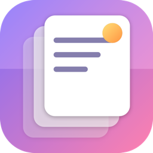

<p align="center">
  
</p>

<h1 align="center">Klyp</h1>

A lightweight, modern clipboard history manager for macOS. Lives in your menu
bar, remembers everything you copy — text, images, files, URLs — and pastes it
back with a keystroke.

Built in SwiftUI for macOS 14+. Free and open-source. A successor in spirit to
CopyClip and CopyClip 2 — but one that doesn't fall over.

## Features

- 📋 Tracks text, rich text, images, file references (videos, PDFs, anything),
  and URLs.
- 🔍 Searchable picker beside your pointer on `⌃Space`, or below the menu bar icon when clicked.
- ⌨️ Global hotkey (default `⌃Space`) — leaves `⇧⌘V` free for editor paste-and-match.
- 🔢 Configurable history size (default 10, up to 200).
- 📌 Pin items so they survive eviction.
- ✂️ Smart-trim on paste: multi-line shell snippets (backslash continuations,
  `$`/`#` prompts, box-drawing gutters) are flattened to a single runnable
  line — but only when pasting into a terminal. Markdown, prose, YAML/JSON,
  and code stay intact. Hold `⌥` to paste raw.
- 🧼 Paste as plain text (`⇧↵`): a deterministic clean-up for text copied out of
  a narrow TUI — always removes gutter bars (`⏺ ▎ │`), indentation and stray
  tabs, and rejoins the hard newlines the terminal inserted at the wrap column.
  Paragraphs, lists, tables and fenced code keep their line breaks.
- 🎨 Paste without formatting (`⌃⇧V` anywhere, `⌃↵` in the popover): drops the
  rich-text payload so code copied from VS Code lands without its syntax colors
  or highlight background — characters, indentation and line breaks untouched.
- 📥 Markdown-aware terminal paste: pulls commands out of ``` fences and
  de-indents text quoted under a chat bullet, so copying an LLM reply with
  surrounding prose still pastes a clean runnable command.
- 🧊 Lives in the menu bar only — no Dock icon, minimal CPU.
- 🎨 Native macOS look across light/dark and accent colors.

## Install

### Homebrew (recommended, once published)

```bash
brew install --cask edihasaj/tap/klyp
```

### From source

```bash
git clone https://github.com/edihasaj/klyp.git
cd klyp/macos/KlypApp
xcodegen
xcodebuild -scheme Klyp -configuration Release \
  -derivedDataPath build CODE_SIGN_IDENTITY=- CODE_SIGN_STYLE=Manual
open build/Build/Products/Release/Klyp.app
```

## Permissions

At launch, Klyp offers **Accessibility** permission if it is not enabled. It
uses this to paste into the focused app and to keep the global shortcut working
when macOS stops delivering it. You can also right-click Klyp's menu bar icon
and choose **Enable Accessibility…** to open the setting again.

Klyp does not phone home. History stays on your machine in
`~/Library/Application Support/Klyp/`.

## Default Shortcuts

| Action                       | Shortcut |
| ---------------------------- | -------- |
| Toggle Klyp picker at pointer | `⌃Space` |
| Paste newest, no formatting  | `⌃⇧V`    |
| Paste selected               | `↵`      |
| Paste without formatting     | `⌃↵`     |
| Paste as plain text          | `⇧↵`     |
| Paste original (no trim)     | `⌥↵`     |
| Paste item N (in popover)    | `⌘1–9`   |
| Search                       | type any letter |
| Clear history                | `⌘⌫`     |
| Pin/unpin selected           | `⌘P`     |

## Roadmap

- [ ] Excluded apps (skip 1Password, etc.)
- [ ] Sync across Macs (CloudKit, opt-in)
- [ ] Smart paste (strip formatting on `⌥` modifier)
- [ ] Notarized + signed release builds

## Contributing

See [CONTRIBUTING.md](CONTRIBUTING.md). Issues and PRs welcome.

## License

[MIT](LICENSE).
